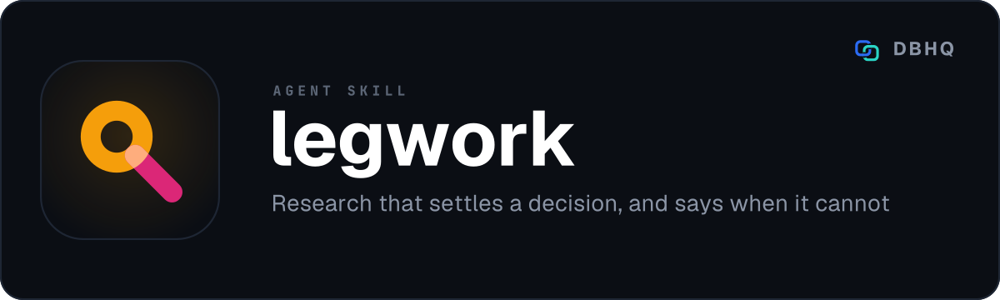

<div align="center">



# Legwork

**Multi-source research that shows its working - every claim tied to a source you can check**

[](LICENSE)
[](https://code.claude.com/docs/en/plugins)
[]()

A free, open-source tool by [DBHQ](https://dbhq.uk)

</div>

---

Research that settles a decision. Ask a real question, get a memo where every factual claim carries an inline `[N]`, every finding states how well it is supported, and a claim that cannot be supported does not ship. Legwork picks a level, announces it, and starts - no questionnaire before it will do anything.

## What makes it different

**A source is judged by the claim it backs, not by its domain.** A vendor's own pricing page is the best evidence available for what something costs and the worst evidence available for whether anyone likes it. Legwork scores fitness per claim kind rather than keeping a list of respectable websites, and recency decays at a rate set by the claim: a two-year-old price is worthless, a two-year-old filing is fine.

**Three sources only count if they could have disagreed.** Pages on one vendor's domains are one voice. Syndicated copies of one wire story are one story. And because Legwork's own search fan-out inflates the number of sources behind a finding, corroboration is counted on the layer it does not amplify: independent groups reached from *different search angles*. Five sources from one query score one confirmation, however many publishers they span.

**It can tell you it could not answer.** If nothing clears the evidence floor, the run says so and names the closest thing it found, rather than producing four thousand hedged words. An honest empty answer is a result.

**Free by default, paid only when needed.** Retrieval runs on the host's built-in `WebSearch` and `WebFetch`. The Bright Data CLI is a *fallback*, used only where the built-ins genuinely cannot do the job - bot-blocked or paywalled pages, Reddit threads, geo-specific SERP. A run against ordinary sources makes **zero** paid calls.

**It does not ask permission to begin.** It infers a level, says which one it picked, and goes. Redirect it mid-run if it guessed wrong; that costs far less than a blocking question on every research request.

**The gates are real.** `check.py` fails a report that cites a page nobody opened, quotes a figure that appears on no page that was fetched, or claims strong support from a single line of enquiry. The suite ships fixtures that are *supposed* to fail, so the gate is proved to bite rather than assumed to.

## Install

### As a Claude Code plugin (recommended)

```
/plugin marketplace add dbhq-uk/marketplace
/plugin install legwork@dbhq
```

### Local install (Claude Code or Codex)

```bash
git clone https://github.com/dbhq-uk/legwork-skill.git
cd legwork-skill
./install.sh          # Claude Code: symlinks into ~/.claude/skills (edits are live)
./install-codex.sh    # Codex: installs into ~/.codex/skills
```

**No virtualenv, no packages.** Every script is Python standard library only, on 3.9 or newer. That is the whole dependency list.

Optional, for the fallback provider:

```bash
npm install -g @brightdata/cli   # or: curl -fsSL https://cli.brightdata.com/install.sh | sh
brightdata login                 # or: export BRIGHTDATA_API_KEY=...
```

Setup succeeds without it - you simply lose fallback scraping.

## Usage

```
legwork: tradeoffs of pgvector vs a dedicated vector DB at our scale
research in deep mode: regulatory exposure of shipping this feature in the EU
quick: what changed in the EU AI Act in the last six months?
```

Add `brief` or `full report` to override the deliverable format.

### Levels

Depth raises rigour. It never raises length.

| Level | Duration | Format | What the extra effort buys |
|---|---|---|---|
| quick | 3-5 min | brief | SERP snippets; fetch only to pin a figure |
| standard **(default)** | 8-12 min | brief or report | Direct-fetch the top sources per finding; one disconfirming search each |
| deep | 20-40 min | report | A primary source for every finding, a per-finding disconfirming pass, and an origin audit |

Set a different default with `export LEGWORK_DEFAULT_MODE=deep`.

## Search backend

| Situation | Provider |
|-----------|----------|
| Normal search and page reads | `WebSearch` / `WebFetch` (free) |
| Page is bot-blocked, paywalled, or JS-heavy | Bright Data `-m scrape` |
| Reddit thread | Bright Data `-m reddit` (billed per record) |
| Geo-specific or vertical SERP (`--country`, news, images) | Bright Data SERP |
| Coverage still thin after 2-3 query variants | Bright Data SERP |

On any failure the wrapper emits JSON to stderr and exits non-zero, and the skill falls back to the built-ins. Auth and quota failures map to exit code `2`, so you are told to re-authenticate rather than left silently degraded.

## Output

Written to `<output-base>/[Topic]_Research_[YYYYMMDD]/`, where `<output-base>` is `$LEGWORK_OUTPUT`, else `<git-root>/docs/research/`, else `$PWD/docs/research/`.

Two files, sharing the folder's base name so they group and sort together:

```
Outlook_Email_SaaS_Research_20260728/
  Outlook_Email_SaaS_Research_20260728.md     the deliverable
  Outlook_Email_SaaS_Research_20260728.tsv    the fetch log
```

**Markdown only.** No HTML, no PDF.

The fetch log is one row per retrieval: URL, source kind, the search angle that surfaced it, how it was retrieved, and the numeric tokens found on the page. It is what lets the gate prove a cited page was actually opened and a quoted figure actually appeared on it, without storing any page text.

## Scripts

All standard library only, Python 3.9+.

Four of them, all standard library only, Python 3.9+.

| Script | Purpose |
|--------|---------|
| `sources.py kinds \| log \| score` | The source-kind vocabulary, the fetch log, and fitness scoring per claim kind |
| `independence.py groups \| check` | Collapse sources into independent voices; count angle-aware corroboration |
| `check.py --report P --level L` | The shippability gate: structural, evidence, independence |
| `bd_search.py` | Bright Data fallback wrapper |

## Tests

```bash
python3 -m pytest skills/legwork/tests/ -v      # no network required
```

CI runs the suite across Python 3.9-3.13, plus an end-to-end smoke job that pushes the shipped fixtures through the real gates in both directions - asserting that sound deliverables pass *and* that each broken one is rejected for its own specific reason - runs a full log-to-gate lifecycle, and asserts setup succeeds with no Bright Data CLI present.

One CI job exists solely to guard the property the independence layer is for: six distinct publishers logged against a single search angle must still fail a corroboration bar of two. A unit test that calls the gate directly cannot catch a gate that never binds in production.

## Known limitations

- **Publish dates are often missing** from SERP results. Legwork reports an unknown date rather than assuming one, but the recency signal is weaker for those sources. Backfill from page meta tags where you have the page anyway.
- **Source kinds are inferred conservatively** when you do not pass `--kind`: an unrecognised URL is logged as `unknown` and scored below commentary, because a confident wrong guess silently moves a source between tiers.
- **The Reddit pipeline is slow** (10-60s typical, occasionally minutes) and billed per record. Prefer top-relevance threads.
- **Trustpilot cannot be scraped** - the Unlocker zone blocks it and there is no pipeline equivalent. Use SERP snippets and quote only what the snippet shows.

## Development

See [`docs/dev-setup.md`](docs/dev-setup.md). Design rationale is in [`docs/design-notes.md`](docs/design-notes.md).

## License

[MIT](LICENSE) © 2026 DBHQ Consulting Ltd
